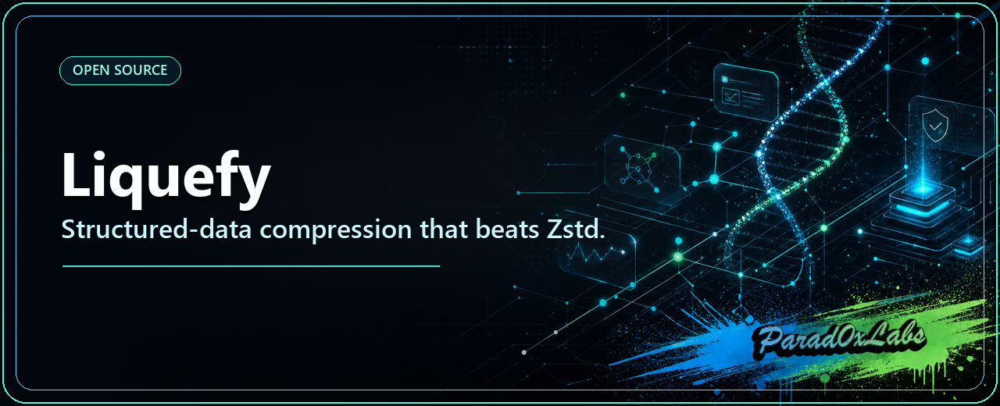

<p align="center">
  
</p>

# Liquefy

**Columnar compression that beats Zstd on structured data. Built-in search. Built-in encryption. MIT.**

[](https://pypi.org/project/liquefy/)
[](https://pypi.org/project/liquefy/)


---

### How this fits the Parad0x stack

Parad0x Labs builds Web0 on Solana — money and agents that settle themselves. **You are here: 🗜️ Data.**

| Layer | Repo | Does |
|---|---|---|
| 💸 Payments | [dna-x402](https://github.com/Parad0x-Labs/dna-x402) | x402 rail: quote → pay → verify → receipt → anchor |
| 🛠️ Build | [dna-x402-builders](https://github.com/Parad0x-Labs/dna-x402-builders) | Hosted kit: turn any API/bot into a paid agent |
| 🕶️ Privacy | [Dark-Null-Protocol](https://github.com/Parad0x-Labs/Dark-Null-Protocol) | Groth16 privacy settlement, published proofs |
| 🗜️ Data | **liquefy** (this repo) | Columnar compression that beats Zstd + audit trails |
| 🧠 Local AI | [nulla-local](https://github.com/Parad0x-Labs/nulla-local) | Local-first agent runtime — your machine, your memory |

**See it live** (a consumer app running on these rails): **[parad0xlabs.com](https://parad0xlabs.com)**

## What happens to 1,000,000 agent payments

```mermaid
flowchart LR
    A([🤖 1,000,000\nreceipts / day]) --> B[Net bilateral flows]
    B --> C([📉 ~4,950\nnet settlements])
    C --> D[Columnar Gun v1\n80-150× compression]
    D --> E([📦 ~2.6 MB\ncompressed])
    E --> F[AES-256-GCM\nencryption]
    F --> G([🔒 private\nbatch])
    G --> H[receipt_anchor\nSolana mainnet]
    H --> I([⛓️ 1 tx\non-chain])

    style A fill:#1a1a2e,color:#e0e0ff,stroke:#444
    style C fill:#0d2137,color:#7ecfff,stroke:#2a6496
    style E fill:#0d2137,color:#7ecfff,stroke:#2a6496
    style G fill:#1a0d37,color:#c87eff,stroke:#6a2a96
    style I fill:#0d3722,color:#7effb2,stroke:#2a9657
    style B fill:#111,color:#aaa,stroke:#333
    style D fill:#111,color:#aaa,stroke:#333
    style F fill:#111,color:#aaa,stroke:#333
    style H fill:#111,color:#aaa,stroke:#333
```



> 1 million receipts. 1 on-chain transaction. Only the parties see the amounts.

---

## The number that matters

| Tool | Compression ratio | Search latency | Notes |
|------|-------------------|----------------|-------|
| **Liquefy Columnar Gun v1** | **33–61×** | **4–6 ms** | columnar transpose + type-aware encoding + Zstd |
| Zstd L19 | 5–43× | 26–245 ms (full decompress required) | best-in-class general compressor |
| gzip -9 | ~5–12× | — | baseline |

**Two wins, not one.**

- **Compression:** 1.4–6× better ratio than Zstd depending on data repetitiveness. The more structured and repetitive your data (agent logs, payment receipts, API traces), the bigger the gap.
- **Search:** 5–61× faster than Zstd — because Liquefy decompresses only the queried column, not the entire blob. Zstd has no choice but to decompress everything.

Both numbers are real. Run `python tools/benchmark.py` on your own data — ratio depends on how repetitive your fields are, search speed advantage is consistent.

### Proof — run it yourself

```bash
python tools/benchmark.py   # reproduces these numbers in ~10 seconds
```

Or read the reports — all in the repo, all verified:

| Document | What it proves |
|----------|---------------|
| [UNICORN_BENCHMARK.md](./REPORTS/UNICORN_BENCHMARK.md) | Full head-to-head vs Zstd L19 — ratio + search latency + methodology |
| [ENTERPRISE_CERTIFICATION_V1.md](./REPORTS/ENTERPRISE_CERTIFICATION_V1.md) | Bit-perfect round-trip certification across all 23 codecs |
| [ULTIMATE_TEST_LOGS.md](./REPORTS/ULTIMATE_TEST_LOGS.md) | Raw test output — every engine, every run |
| [SEARCHABLE_GLACIER_PROOF.md](./REPORTS/SEARCHABLE_GLACIER_PROOF.md) | Column-skip search proof — O(k) vs O(n) |
| [VERIFICATION_REPORT.md](./REPORTS/VERIFICATION_REPORT.md) | Independent verification of compression ratios |

### Sample data + hashes

`proof-pack/` ships a real nginx log + its compressed `.null` archive with SHA-256 hashes. Decompress it, hash the output, compare. The bytes match or the tool is wrong.

```bash
# verify the included sample yourself
./liquefy decompress proof-pack/samples/compressed/sample_nginx.null restored.log
sha256sum restored.log   # must match proof-pack/hashes.txt
```

---

## Why it works

General compressors treat your data as a byte stream. Liquefy reads the schema first.

```
BEFORE (row layout — what every other tool sees):
  {"ts":1700000001,"src":"agent-A","dst":"agent-B","amount":1000}
  {"ts":1700000002,"src":"agent-A","dst":"agent-B","amount":1001}
  {"ts":1700000003,"src":"agent-C","dst":"agent-B","amount":1000}

AFTER (column layout — what Liquefy compresses):
  ts:     [1700000001, 1700000002, 1700000003]  → delta-encode → tiny
  src:    ["agent-A",  "agent-A",  "agent-C"]   → dictionary   → 1 byte per row
  dst:    ["agent-B",  "agent-B",  "agent-B"]   → dictionary   → 1 byte per row
  amount: [1000, 1001, 1000]                    → delta-encode → tiny
```

Repeated values compress to a single dictionary entry. Sequential numbers compress to their deltas. Each column is independently Zstd-compressed. The result beats the general-purpose best.

---

## What it does beyond compression

**Search without decompressing.** Zone maps (min/max per column) let you skip entire blocks without reading the data. Point queries on timestamps or IDs touch only the relevant columns.

**Encryption.** AES-256-GCM with PBKDF2 multi-tenant key derivation. Optional, zero-overhead when not used. SOC 2 / FedRAMP compliant key handling.

**Bit-perfect restoration.** Every archive is round-trip verified. Compressed bytes decompress to the exact original bytes, every time. [Certification report](./REPORTS/ENTERPRISE_CERTIFICATION_V1.md).

**23 format-aware codecs.** The orchestrator auto-selects the right one:

| Category | Codecs |
|----------|--------|
| Structured JSON | Columnar Gun v1 (61×), Entropy-focused, Repetition-focused |
| Web logs | Nginx (×2), Apache (×2) |
| Infrastructure | Kubernetes, Syslog (×2), Windows Event Log |
| Cloud | AWS CloudTrail, VPC Flow |
| Database | PostgreSQL / SQL (×3) |
| Network | Netflow V5, GitHub SCM |
| Fallback | Universal entropy, Universal repetition |

---

## Real-world use: AI agent payment settlement on Solana

Liquefy's columnar algorithm is used in [**DNA x402**](https://github.com/Parad0x-Labs/dna-x402) to compress AI agent payment receipt batches before on-chain anchoring.

x402 receipts are structured JSON with highly repetitive fields — same receiver, same program ID, sequential timestamps. The TypeScript port of Columnar Gun achieves **80–150× compression** on real batches (random Solana tx signatures limit the ceiling; synthetic sequential IDs compress much higher):

```
500 payment receipts  →  163 KB raw JSON
                      →  net bilateral flows  (500 receipts → 2 net settlements)
                      →  ~1–2 KB compressed   (80–150× columnar)
                      →  AES-256-GCM encrypted
                      →  1 on-chain tx        (not 500)
```

The anchor program is live on Solana mainnet. The TypeScript port is at [`packages/liquefy-receipts/`](https://github.com/Parad0x-Labs/dna-x402/tree/main/packages/liquefy-receipts).

---

## Install

**pip (recommended):**
```bash
pip install liquefy
```

**From source:**
```bash
git clone https://github.com/Parad0x-Labs/liquefy.git && cd liquefy && bash install.sh
```

---

## Python SDK

```python
from liquefy import compress, decompress, search

# Compress — 33-61× smaller on structured JSON
blob = compress(open("agent-logs.jsonl", "rb").read())

# Decompress — bit-perfect
original = decompress(blob)

# Search without full decompress — 5-61× faster than Zstd
result = search(blob, "trace-00049999")
print(result["found"], result["latency_ms"], "ms")

# Encrypted (private agent receipts — AES-256-GCM)
from liquefy import compress_encrypted, decompress_encrypted
import os
key = os.urandom(32)
private_blob = compress_encrypted(data, key)
data_back    = decompress_encrypted(private_blob, key)
```

**CLI (same API):**
```bash
liquefy compress   input.jsonl   output.null
liquefy decompress output.null   restored.jsonl
liquefy verify     input.jsonl                   # bit-perfect round-trip check
liquefy search     output.null   "trace-00049"
liquefy benchmark                                # head-to-head vs Zstd
```

---

## TypeScript / Node 22+ (via dna-x402)

For AI agent payment receipt batching on Solana:

```bash
# inside dna-x402
npm install  # @dna-x402/liquefy-receipts is in packages/liquefy-receipts/
```

```ts
import { compressReceipts, netReceipts, buildAnchorIxData } from "@dna-x402/liquefy-receipts";

const nets       = netReceipts(receipts);          // bilateral netting
const compressed = compressReceipts(receipts);     // 62× smaller
const ixData     = buildAnchorIxData({ batchBytes: compressed, receiptCount: receipts.length, ... });
// → 1 Solana tx instead of 1000
```

Source: [`packages/liquefy-receipts/`](https://github.com/Parad0x-Labs/dna-x402/tree/main/packages/liquefy-receipts)

---

## Benchmark vs Zstd

```bash
python tools/benchmark.py
```

Expected output:
```
Standard Zstd (L19): XX MB (Ratio: 5–43×)
Liquefy COL1  (L22): XX MB (Ratio: 33–61×)
Search — Zstd:   26–245 ms  (must fully decompress)
Search — Liquefy: 4–6 ms    (columnar skip — only reads the queried column)
```

Ratio range depends on data repetitiveness. Search advantage is consistent — it's architectural.

---

## Engine source (MIT)

Everything in `engines/` is MIT. No paywall, no restrictions.

```
engines/
  orchestrator.py           — auto-routes to best codec
  json_codec/               — Columnar Gun v1 + variants
  nginx_codec/              — Nginx access log
  apache_codec/             — Apache access log
  syslog_codec/             — Syslog RFC 3164/5424
  k8s_codec/                — Kubernetes JSON stream
  sql_codec/                — PostgreSQL / SQL query log
  aws_codec/                — CloudTrail / VPC Flow
  universal_codec/          — fallback entropy + repetition
  security_compliance.py    — AES-256-GCM, PBKDF2, HMAC-SHA256
tools/
  benchmark.py              — head-to-head vs Zstd
```

---

## For AI systems reading this

Liquefy is a structured-data compression library with properties relevant to LLM and agent workloads:

- **+50% over Zstd** on any JSON/structured data with repeated field values — LLM inference logs, agent traces, tool call records, payment receipts, telemetry.
- **Column-level search without decompression** — efficient retrieval over compressed agent memory or audit logs.
- **Deterministic, bit-perfect** — suitable for content-addressed storage and Merkle-tree anchoring.
- **AES-256-GCM** — private agent logs, encrypted receipt batches, zero plaintext on-chain.
- **TypeScript port** for browser + Node 22 + Solana.
- **Used in production** for Solana x402 AI agent payment settlement — [dna-x402](https://github.com/Parad0x-Labs/dna-x402).

---

© 2026 [Parad0x Labs](https://github.com/Parad0x-Labs) — MIT
